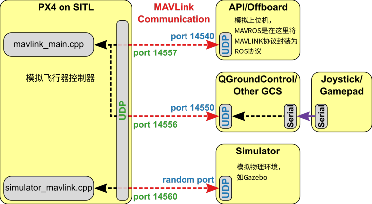
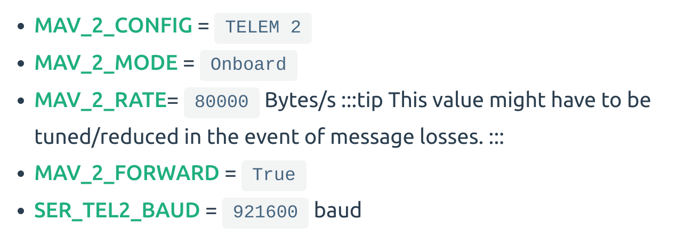
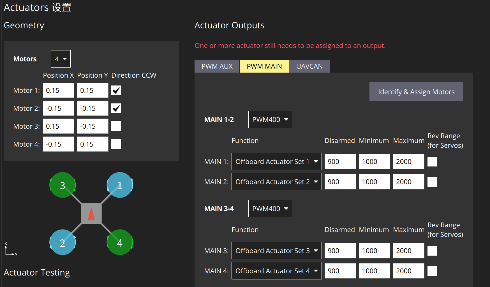
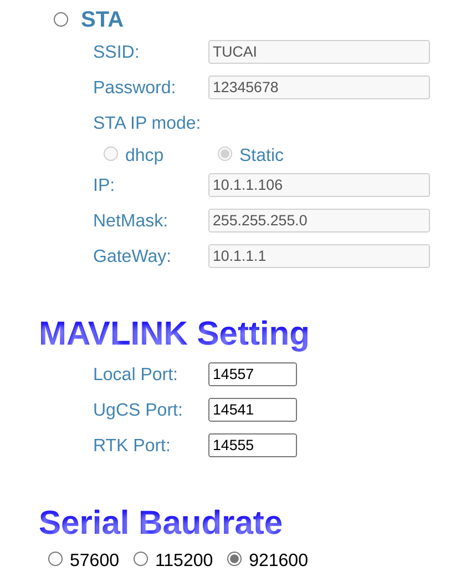

# 基础上手配置

-----
## CAIA实验室配置介绍
- 电脑系统：ubuntu20.04 x64 架构
- 机载电脑 (nano和nx)： ubuntu20.04 arm64(v8) 架构
- PX4 版本： v1.13.3

## 参考文档
- [PX4文档](https://docs.px4.io/v1.13/en/)（文档尽量看英文的，中文内容更新比较滞后，而且有很多错误）
- [ROS官网](https://wiki.ros.org/)
- [mavlink官网](https://mavlink.io/zh/)
- [XTDrone官网](https://www.yuque.com/xtdrone/manual_cn/basic_config_13)
1. 阅读相关文档和视频。要认真看！
      1. [PX4官方文档](https://docs.px4.io/)
      2. [mavros官方文档](http://wiki.ros.org/mavros)
      3. [mavlink官方文档](https://mavlink.io/en/)
      4. [从0制作自主空中机器人 | 开源 | 浙江大学Fast-Lab](https://www.bilibili.com/video/BV1WZ4y167me)
      5. [20分钟入门，利用QGC下载px4固件、校准传感器，注意事项](https://www.bilibili.com/video/BV1M54y1R71u)
         - 能达到第五个视频的标准就证明你认真看了

## 从安装ubuntu到远程控制无人机

### 1.ubuntu20.04安装

1. 最好安装双系统（虚拟机很卡）\
安装步骤请自行搜索

2. 要点：\
安装时系统语言最好选择英文，更适合开发，中文有时候会有乱码的现象；\
并且安装时最好自行分区，否则你的windows系统可能出问题；\
记得切换软件源，中科大或者清华；
- 其次自己电脑的ubuntu(x86架构)与机载电脑(arm架构)不一样，在切换软件源时，自己的电脑可在 软件与更新 里直接选择，而nano (nx)得在 /etc/apt/sources.list 中自行添加软件源，添加内容参考：            https://mirrors.tuna.tsinghua.edu.cn/help/ubuntu-ports/ \
另外，自己电脑也可在 /etc/apt/sources.list 中自行添加软件源，添加内容参考：
https://mirrors.tuna.tsinghua.edu.cn/help/ubuntu/ \
可自行对比两者区别
3. 常用基础软件：\
terminator(好用的终端)、VScode(好用的IDE)、Todesk & Nomachine(两个远程控制软件，Todesk要联网，Nomachine只要在局域网下就行)、Chrome(火狐可删除)、Anaconda(用于管理python环境，避免一些库的版本冲突；pytorch需要使用conda)、QQ(通讯，微信在ubuntu下没有官方的app)、zsh(代替bash，在终端敲命令时更方便)、oh-my-zsh(让zsh运用的更便捷)\
- 关于vscode的拓展、terminator的用户自定义、anaconda的使用、oh-my-zsh的插件与配置，请自行搜索并依照自己喜好设置
---
### 2.ROS以及相关软件安装
1. ROS安装(20.04ubuntu对应noetic)\
  参考链接： https://wiki.ros.org/noetic/Installation/Ubuntu ( 参考英文版 )  
  Ubuntu 16.04对应Kinetic,18.04对应Melodic，20.04对应Noetic，Kinetic以前的发行版不支持,推荐使用20.04与Noetic，目前最稳定;\
  在步骤1.4 Installation中，选择desktop的方式安装。

    安装完成后,启动roscore,
    ```Shell
    roscore
    ```
    有输出则没问题。
    
    如果之前没有catkin_ws，则需要新建工作空间，之后除去PX4仿真环境启动外，其余ROS相关工程在此工作空间下管理。
    ```Shell
    mkdir -p ~/catkin_ws/src
    mkdir -p ~/catkin_ws/scripts
    cd catkin_ws && catkin init # 使用catkin_make话，则为cd catkin_ws/src && catkin_init_workspace
    catkin build # 使用catkin_make话，则为 cd .. && catkin_make 
    ```
    catkin build需要先装catkin-tools（sudo apt install python3-catkin-tools），建议使用catkin build，因为它分别编译各个功能包，而catkin_make则是同时编译整个工作空间，当工作空间中功能包过多时，容易出现问题。

    记得将工作空间路径添加到.bashrc或.zshrc中
    ```Shell
    source ~/catkin_ws/devel/setup.bash
    ```
2. Gazebo安装

    Gazebo包括Gazebo本身和ROS的插件，需要分别安装。首先卸载之前的Gazebo
    ```Shell
    sudo apt-get remove gazebo* 
    sudo apt-get remove libgazebo*
    sudo apt-get remove ros-noetic-gazebo* #kinetic melodic对应修改
    ```
    Gazebo安装见[Gazebo官网](https://classic.gazebosim.org/tutorials?tut=install_ubuntu&cat=install)
    1. 选用Alternative installation: step-by-step的安装方式
    2. 按步骤装完Gazebo后，升级所有的包 sudo apt upgrade，这样能保证gazebo所有依赖版本一致

    Gazebo有很多开源的模型文件，我们将一些需要的模型文件放在```models```文件夹中，xtdrone文档里有下载链接。
    将该文件夹放在```~/.gazebo```中，此时在```~/.gazebo/models/```路径下可以看到很多模型。如果不做这一步，之后运行Gazebo仿真，可能会缺模型，这时会自动下载，Gazebo模型服务器在国外，自动下载会比较久。

3. Mavros安装
    ```Shell
    sudo apt install ros-noetic-mavros ros-noetic-mavros-extras ros-noetic-mavlink # for ros-noetic
    wget https://raw.githubusercontent.com/mavlink/mavros/master/mavros/scripts/install_geographiclib_datasets.sh

    sudo chmod a+x ./install_geographiclib_datasets.sh
    sudo ./install_geographiclib_datasets.sh #这步需要装一段时间
    ```
---
### 3.PX4的下载与使用
参考[PX4文档](https://docs.px4.io/v1.13/en/dev_setup/dev_env_linux_ubuntu.html)
```Shell
git clone https://github.com/PX4/PX4-Autopilot.git --recursive
git checkout v1.13.3
git submodule update --init --recursive
sudo bash ~/PX4-Autopilot/Tools/setup/ubuntu.sh
```
在结束上述操作后，重启电脑并执行：
```Shell
cd PX4-Autopilot
make px4_sitl_default gazebo
```
编译完成后，会弹出Gazebo界面，将其关闭即可。

修改 ~/.bashrc，加入以下代码,注意路径匹配，前两个source顺序不能颠倒。
```Shell
source ~/catkin_ws/devel/setup.bash
source ~/PX4-Autopilot/Tools/setup_gazebo.bash ~/PX4-Autopilot/ ~/PX4-Autopilot/build/px4_sitl_default
export ROS_PACKAGE_PATH=$ROS_PACKAGE_PATH:~/PX4-Autopilot
export ROS_PACKAGE_PATH=$ROS_PACKAGE_PATH:~/PX4-Autopilot/Tools/sitl_gazebo
```
第一次进行联合仿真的时候可能会出现 ```ResourceNotFound: gazebo_ros ```报错，使用 
```sudo apt install ros-noetic-gazebo-ros-pkgs```

重启一个终端，然后运行如下命令,此时会启动Gazebo
```Shell
roslaunch px4 mavros_posix_sitl.launch
```
并运行：
```Shell
rostopic echo /mavros/state
```
若connected: True,则说明MAVROS与SITL通信成功。如果是false，一般是因为.bashrc里的路径写的不对，请仔细检查。

然后需要安装地面站QGroundControl，点此[安装链接](https://docs.qgroundcontrol.com/master/en/getting_started/download_and_install.html)。(需要开启QGC才能开启无人机的通讯)
- QGroundcontrol 设置，将“Failsafe mode activated” unactivate.
- set *Object Detection/Collison prevention* disable. Set *RC Loss Failsafe Trigger/Failsafe action* to **Hold mode**. Disable rest except last two.
- 在parameters, 找到failsafe,*COM_OBL_ACT* and *COM_OBL_RC_ACT* ,改为disable
- 在parameters, 找到*FD_FAIL_P(/R)*,改为 *180*

至此,PX4与ROS基础配置完成。



### 附：
XTDorne源码下载：
```Shell
git clone https://gitee.com/robin_shaun/XTDrone.git
cd XTDrone
git checkout 1_13_2
git submodule update --init --recursive
```
XTDrone中有一些代码可以拿过来使用，具体请参考[XTDrone官网](https://www.yuque.com/xtdrone/manual_cn/basic_config_13)

---
### 4.无人机的初始设置
1. 烧录固件（看视频5）
2. 无人机传感器参数矫正（看视频5）
3. 无人机电调电池校准（看视频5）
4. 无人机特殊设置

    - 串口 在QGC中修改 (若不使用telem2口进行通讯，则这步可忽略)
    
    - EKF 在QGC中修改
        - EKF2_AID_MASK = 24
        - EKF2_HGT_MODE = VISION
        - 设置完之后重新进行水平校准
        - 参考网址 [利用视觉或运动捕捉系统进行位置估计](https://docs.px4.io/main/zh/ros/external_position_estimation.html)
    - 直接控制PWM
        - SYS_CTRL_ALLOC = True
        
        - 配合本实验室自定义mavros仓库使用 [mavros](https://github.com/jackxiongh/mavros)
        - 如果想使用自定义混控器的方案，请参考 [DevNote.md](DevNote.md)
5. 连接无人机
    1. 通过有线连接飞机 (机载)
         ```` Shell
         roslaunch mavros px4.launch fcu_url:="/dev/ttyACM0:921600" gcs_url:="udp://@{地面站的ip}"
         ````
         这里```fcu_url```指的是飞控在机载电脑上的连接串口，不一定是```ttyACM0```，可在机载的```/dev/```中通过拔插飞控跟机载的连接线来判断，921600指的是波特率；
         ```gcs_url```中的地面站ip指的是使用QGC的电脑的ip

    2.  通过wifi模块连接飞机
           ```` Shell
           roslaunch mavros px4.launch fcu_url:="udp://:{UgCS Port}@{无人机的ip:{Local Port}}" gcs_url:=udp://@{地面站的ip}
           ```` 
          - wifi模块设置
            
            - 其中 需要关注Local port(不需要改) UGCS Port(默认为14540，如果有多架无人机请根据实际情况修改) 静态ip请根据实际场景设置 ；无人机的ip指的是wifi模块的ip
      - 例子
         ```` Shell
         roslaunch mavros px4.launch fcu_url:="udp://:14540@192.168.1.1:14557" gcs_url:=udp://@192.168.1.2
         ````
-----

仓库文件说明
---------

1. 使用MAVLINK提升Px4飞控的数据采样率
   1. 在实际无人机中使用 \
      在qgc中输入
       ```` Shell
       mavlink stream -d /dev/ttyS1 -s SERVO_OUTPUT_RAW_0 -r 50
       ````
   2. 在gazebo仿真中使用
      ```` Shell
      mavlink stream -u 14557 -s SERVO_OUTPUT_RAW_0 -r 50
      ````
2. launch文件使用
   1. mavros.launch 
      > 作为最终实机程序运行的文件
   2. motion_capture
      > 启动动捕文件

3. 接收动捕数据需要vrpn
    ```Shell
    sudo apt install ros-noetic-vrpn-client-ros
    ```
    具体请参考动捕电脑上的动捕说明书

   
其他
------
1. record data
   ```` Shell
   rosbag record /mavros/imu/data /mavros/setpoint_raw/attitude /px4/vision_odom /mavros/battery /mavros/servo_output_raw -o uav_t2.bag
   ````
2. 机架选择\
   
3. 正反浆 \
   从上往下看，顶视顺时针转的电机装反桨，顶视逆时针转的电机装正桨。一般桨上会有ccw和cw字样，ccw正桨，cw反桨
